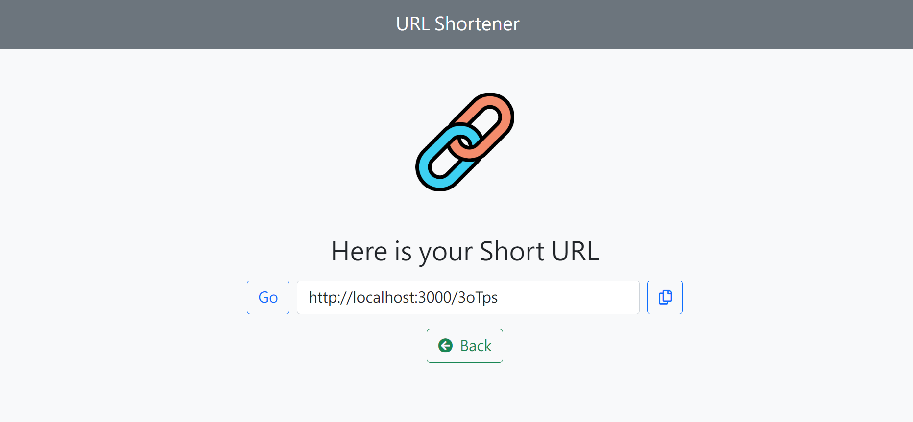

# URL Shortener




## Features
- Generate a short URL.
- Use the short URL to visit the original URL 
- Click the copy button to copy the short URL directly.

## Getting Start

### Prerequisites
:white_check_mark: Be sure that Node.js and npm are installed already. 

### Installing
:white_check_mark: Clone or download the project to your folder

```bash
git clone https://github.com/bft7658/URL-Shortener.git
```

:white_check_mark: Open `Terminal` to install the required packages  

```bash
npm install
```

:white_check_mark: Set environment variable 

```bash
export MONGODB_URI = "<your URI>"
```

:white_check_mark: Start the server after install finished

```bash
npm run dev
```

:white_check_mark: Run the browser when your `Terminal` shows the link 

```bash
App is running on http://localhost:3000
```

:white_check_mark: Stop using browser by

```bash
Ctrl + c
```

## Development Tools
- Node.js 16.14.0
- Express 4.17.3
- express-handlebars 4.0.2
- Bootstrap 5.1.3
- Font-awesome 5.8.1
- MongoDB
- mongoose 6.1.6